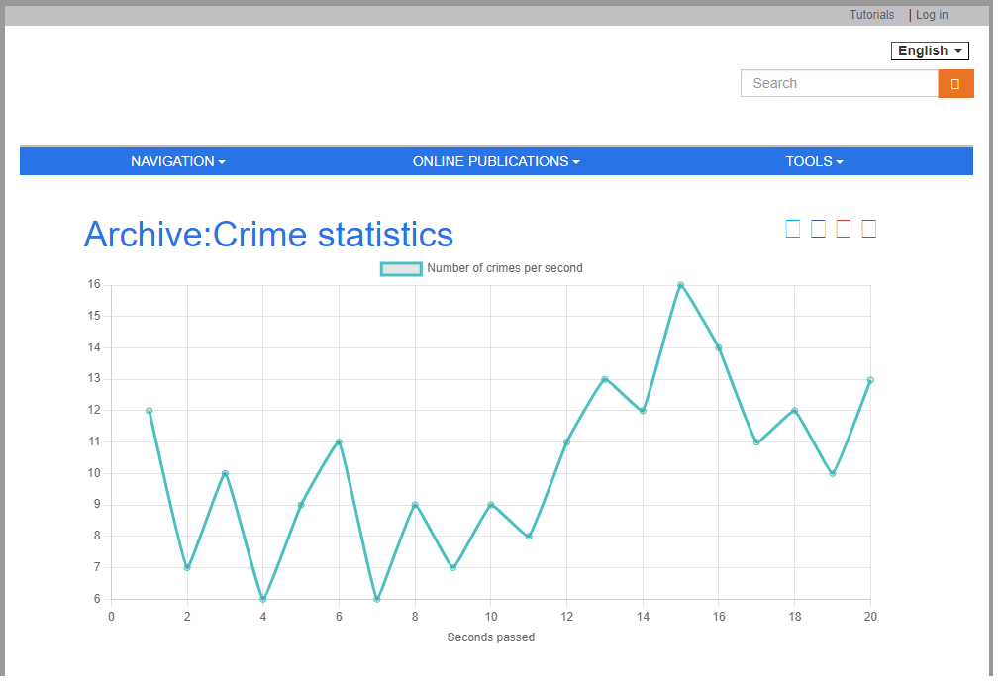
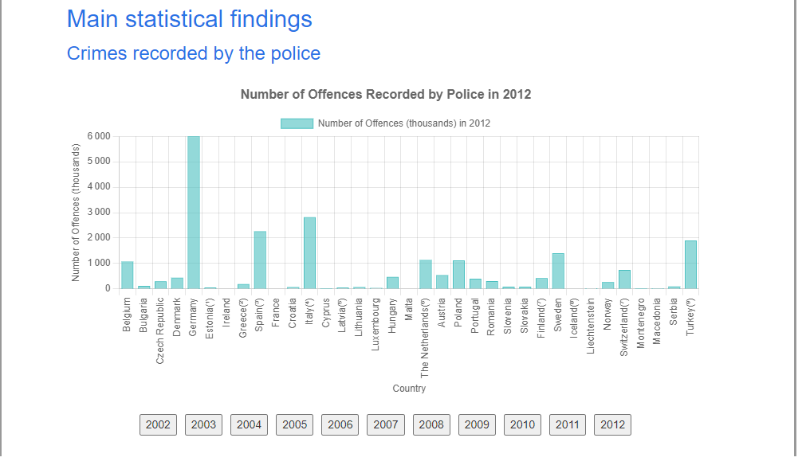

# Javascript Challenge : "Data Visualisation"

- repository : `js-datavisualisation-challenge`

- mode: `solo`

- type: `consolidation challenge`

- duration: `5 days` (15/07/24 -- 08:45 a.m.)

- form: /

## Objectives

This consolidation challenge will help you assess your ability to solve a problem inspired from real-life situations using your new javascript muscles involving the following know-hows :

- **DOM** manipulation
- **AJAX**/**FETCH** request
- Using **Third-party libraries**
- **problem-solving** : design a logical solution to implement the expected result
- Debugging using the console
- Understand the notion of **"separation of concerns"**

## The correct index to load
[Here is the correct index to load, couldn't figure out how to deploy from here](https://github.com/LuanPM284/javascript-data-visualisation/blob/main/challenge-js-files/index.html)

Here are the images that should be displayed:

## Your mission

You work in the Multimedia department of one of the European Union institutions. This morning, Johnny Hasnoclew, your Project Manager, sends you on a mission: one of the in-house journalists has published a new article on the institution's website. The article in question is already integrated with an **html** / **css** / **Javascript file**.

He asks you to make it more _rich_, more _interactive_, more... _sexy_ (The use of that specific adjective indicates that Johnny certainly worked in advertising before, the poor guy).

That's exactly what you're going to do, by adding two **interactive data visualisation graphics** using javascript. These graphs will be interactive in the sense that the user can manipulate the graph, such as filtering data, or reveal detailed data when the mouse hovers over it. You are free to design the interaction in your project.

### 1. Inline data (data in the document)

In this html file, you will find two data tables. Use JavaScript to traverse the DOM to insert right above each of these tables a representation of its data in the form of an interactive graph.

If javascript is disabled, the graph does not appear. If javascript is enabled, the graph appears between the title and the table.

#### Notes 1
Had a hard time placing the chart in the right place, since I ended up just copying an h3 instead of using the table id to show it before. I found a method to do that.

For the table retrieval data, it was easier with the help of a colleague, for some bizarre reason the chart was not being displayed, but with the **same** code as GPT it _worked!_

### 2. Remote data, in real-time, via ajax

There are data sitting at this URL : [https://canvasjs.com/services/data/datapoints.php](https://canvasjs.com/services/data/datapoints.php)

Retrieve the data via Ajax, and use it to insert a graph that refreshes every second, just below the main title (`h1`) of the article.

Don't hesitate to adapt the code provided in this tutorial: [Live Updating Charts from JSON API & AJAX](https://canvasjs.com/docs/charts/how-to/live-updating-javascript-charts-json-api-ajax/), but adapt it to this third-party library: [chart.js](https://www.chartjs.org/) or [ToastUi-Chart](https://ui.toast.com/tui-chart/), because this tutorial uses another (not-free) library (canvasJS).

**Again**: if javascript is disabled, the graph does not appear. If javascript is enabled, the graph appears.

## How will we do this?

1. Use a javascript library that makes it easier to do this instead of using just "Vanilla Javascript" (= using javascript without libraries).
   If you had never coded in javascript before BeCode, use [chart.js](https://www.chartjs.org/) or [ToastUi-Chart](https://ui.toast.com/tui-chart/).
   If you already had a good knowledge of Javascript before you switched to BeCode, you can directly use the [D3.js - Data-Driven Documents](https://d3js.org/) library, which is more complex but offers many possibilities.
2. Get trained in their use.
3. Attack the problem by looking for a good logical path. Break it down into **small problems**, into **progressive** steps. Commit as you move forward. First the DOM, access the right place, then retrieve the data, then generate the graph. Something like that 😉
4. A method of thinking: _Reverse-engineering_ of your objective: start at the end and go up the thread of dependencies to the starting point. It gives something like this:

> - To have a graph, you need data. So I have to get them back.
> - Where is this data ?
> - To have a graph I have to find the right place in the DOM, how can I do that?
> - To get a graph I will use _this_ library of _data visualization_. How does it work?  
>   ...

---

## Constraints

- You can't edit the html file, except to add a `script.js` to load your `js`. Dot not add `css` nor change the structure of the `html`
- You have the choice of the type of graphics. Considers the most relevant based on the data and what story they can "tell".
- The choice of the javascript library is limited to the 2 libraries offered (there are many others, but these are references and are very popular)

---

## Help each other (to a certain extend)

You can help each other under these two conditions:

- You first **searched alone** and **read this** ([How to ask the help of a senior developer 🥇](https://stackoverflow.com/help/how-to-ask))
- The person helping **does not provide a ready-made code** and **does not code for the other**. The objective remains to learn, not to solve. The result is less important than the path. Helps by asking questions, trying to get the other person to find the answer on their own.

## Evaluation

The evaluation method chosen is a **self-evaluation** based on the following indicators:

#### 1. handling of the DOM:

- [ x] I was able to find the right selector to do it.
- [ x] I was able to inject the graph in the right place on the page via javascript.
- [ x] I was able to retrieve the html data in a format adapted to my javascript code.

### 2. Request ajax/fetch:

- [ x] I was able to receive the answer from the remote server in json.
- [ x] Then, I was able to build a callback function to process this data.

### 3. Use of **third party libraries**:

- [x ] I was able to integrate the third-party library into my application.
- [ x] I used the documentation provided by the library.
- [x ] I was able to generate the 2 inline data graphs.
- [ x] I was able to generate the "remote data" graph.

### 4. Problem-solving:

- [ x] Syntactic rigor: I was able to translate the processes I imagined into javascript syntax.
- [ x] Logical thinking: Through iterations and trial and error, I was able to find a logical path that works to address the issues raised by the client's request. Specifically:
  - [ ] I was able to generate the 2 inline data graphs.
  - [ ] I was able to generate the "remote data" graph.
  - [ ] I was able to build a callback function to process remote data (received via ajax).
  - [ ] I was able to make the realtime graph refresh in real time.
  - [ ] I was able to display the detailed data when I hover the mouse.

### 5. Debugging:

- [ ] I use the console to understand what is happening and compare what I am trying to program with what the machine is doing.

### 6. Separation of concerns:

- [ ] If I disable javascript, the user experience is satisfactory, the user has access to data and content
- [x ] If I enable javascript, the tables are enhanced with an interactive graph.

## Good luck !

